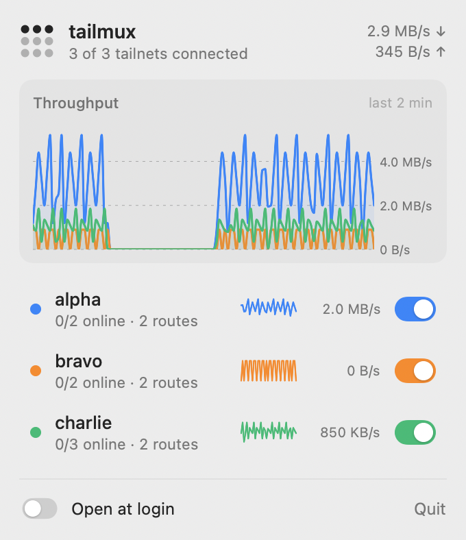

# tailmux

[](https://github.com/GrowlyX/tailmux/actions/workflows/ci.yml)

Be on N tailnets at once.

The official Tailscale client joins one tailnet at a time (`tailscale switch`).
tailmux runs one userspace Tailscale node (`tsnet`) per tailnet inside a
single process and routes every connection to the tailnet that owns its
destination. Your regular Tailscale app can stay on whichever tailnet you like;
tailmux doesn't touch it.

<p align="center">
  
  
</p>

```
                ┌──────────────── tailmux ─────────────────┐
 any app ──TUN──▶  fake-IP DNS + gVisor netstack           │──tsnet──▶ tailnet "work"
 ssh, curl ─────▶  SOCKS5 :1055                            │──tsnet──▶ tailnet "home"
 browsers ──────▶  HTTP proxy + PAC :1056                  │──tsnet──▶ tailnet "lab"
 menu bar app ──▶  /status /stats /tailnets/{name}/enable  │──direct─▶ everything else
                └──────────────────────────────────────────┘
```

## Install

```sh
brew install growlyx/tap/tailmux
```

That builds the CLI and, on macOS, the menu bar app. Then put one entry per
tailnet in `$(brew --prefix)/etc/tailmux/config.json`:

```json
{
  "tailnets": [
    { "name": "work" },
    { "name": "home", "auth_key": "env:TS_HOME_AUTHKEY" },
    { "name": "lab", "control_url": "https://headscale.example.com" }
  ],
  "pins": { "10.0.0.0/24": "home" },
  "tun": { "enabled": true }
}
```

and start it:

```sh
sudo brew services start tailmux   # TUN mode: every app, no proxy settings (needs root)
brew services start tailmux        # proxy mode only
tailmux status                     # login URLs, routes, conflicts
tailmux bar                        # the menu bar app
```

Each tailnet without an `auth_key` prints a login URL on first start. Open each
one in the browser session for that tailnet's account. Every tailnet then gets a
device called `tailmux-<hostname>`. Consider disabling key expiry for it.

Without Homebrew, run `go install github.com/GrowlyX/tailmux/cmd/tailmux@latest`,
or grab a binary from [Releases](https://github.com/GrowlyX/tailmux/releases).
The config then lives at `~/.config/tailmux/config.json`.

## How a destination is routed

Names, in order:

1. **Pins** from the config (`"corp.internal": "work"`).
2. **`host.<tailnet>`**: `db.home` means "db in the tailnet I named home".
3. **Full MagicDNS names** (`db.tail1234.ts.net`). Suffixes are unique per tailnet.
4. **Split DNS domains** configured in each tailnet's admin console. The query
   goes to that tailnet's resolvers *through that tailnet*.
5. **Bare hostnames** (`db`) matched against every tailnet's peers. An online
   peer beats an offline one; after that, config order wins. (Proxy mode only.)
6. Anything else is resolved normally. If the answer lands in a tailnet's
   subnet route, it goes there. Otherwise it goes direct.

IPs: longest prefix wins. A peer's own /32 beats a subnet, and 10.0.5.0/24 beats
10.0.0.0/16. On a tie, an online router wins, then config order. Pins override
all of this. A pin to a disabled or stopped tailnet falls back to normal routing.

Every tailnet hands out addresses from 100.64.0.0/10, so two tailnets often
share an IP. Names never collide, so prefer them. `tailmux status` lists every
contested route and hostname and which tailnet wins.

## TUN mode: every app, no proxy settings

With `"tun": {"enabled": true}` (or `tailmux up -tun`) and root, tailmux does three things:

- It creates a TUN device (`utunN` on macOS, `tailmux0` on Linux) and routes
  every subnet the tailnets advertise into it.
- It points the OS resolver at itself for tailnet domains only: the tailnet
  aliases, the MagicDNS suffixes and the split-DNS domains. On macOS that uses
  `/etc/resolver/<domain>` files. On Linux it uses systemd-resolved routing
  domains.
- It answers tailnet names with **fake IPs** from `198.18.0.0/15`, one per
  name. That keeps `web.work` and `web.home` apart even when both are really
  100.64.0.1. A connection to a fake IP is re-dialed by name through the right
  tailnet.

A userspace TCP/IP stack (gVisor, the same one Tailscale uses) terminates each
TCP and UDP flow and re-dials it through the owning tailnet. So `ssh db.home`,
`psql -h db.corp.internal`, and a browser tab on `http://grafana.lab` all just
work.

Details:

- Subnets that overlap one of your local networks are skipped, so you don't
  lose your LAN. Pin a prefix to force it.
- `100.64.0.0/10` isn't routed by default, so the official Tailscale app can
  keep it. Set `"cgnat": true` to take it over.
- Routes vanish with the interface. Resolver files carry a marker and are
  removed on exit, or at the next start after a crash.
- Traffic that arrives on the TUN is never dialed "directly", so it can't loop
  back into the TUN.

## Proxy mode

Always on, with or without TUN:

- **ssh**: `ProxyCommand tailmux nc %h %p`
- **curl and most CLIs**: `ALL_PROXY=socks5h://127.0.0.1:1055`. Use `socks5h`,
  so tailmux resolves the name.
- **kubectl**: `proxy-url: socks5://127.0.0.1:1055` in the kubeconfig cluster.
- **Browsers or all of macOS**: set the automatic proxy URL to
  `http://127.0.0.1:1056/proxy.pac`. It's generated from the live routing table,
  and everything else stays `DIRECT`.
- **DNS server** (optional): `"dns": "127.0.0.1:1053"` answers with real tailnet IPs.

## Menu bar app (macOS)

The icon is Tailscale's 3×3 dot grid, with one dot lit per connected tailnet.
Dots light in the order that draws Tailscale's "T", so five tailnets spell the
logo. Click it to see every tailnet with an on/off switch, per-tailnet
sparklines, and a two-minute throughput chart.

Switching a tailnet off works like `tailscale down` for that tailnet: its routes
and names drop out immediately and it keeps its login. The choice is remembered
across restarts.

The app talks to the daemon's local API:

| Endpoint | What it does |
| --- | --- |
| `GET /status` | Tailnets, routes, conflicts, TUN state |
| `GET /stats` | Per-tailnet byte counters and a 120-second rate history |
| `POST /tailnets/{name}/enable` / `disable` | Turns a tailnet on or off. Requires an `X-Tailmux` header, which blocks cross-site requests. |

To build it by hand, run `macos/build-app.sh`. It needs only the Command Line Tools, not Xcode.

## Limits

- ICMP (ping) isn't forwarded.
- Bare hostnames (`db` without a suffix) work through the proxies but not
  through TUN DNS, because tailmux doesn't install search domains.
- Exit nodes are ignored.

## Development

```sh
go test ./...        # unit + end-to-end, a few seconds
go test -race ./...  # what CI runs
```

The tests run **three complete tailnets in-process**. Each one has Tailscale's
own test control server, a DERP relay, web servers and subnet routers. The
setup collides on purpose:

- every tailnet's `web` node gets the same IP;
- two tailnets route the same 192.0.2.0/24;
- one tailnet serves `corp.internal` over split DNS.

`internal/tun` pushes real packets through the TUN engine from a second
userspace stack standing in for the OS. `TestSystem` does it for real as root:
it creates the TUN device, sets up routes and the system resolver, then runs
plain `http.Get("http://web.bravo/")`. CI runs it on Linux and macOS.

To try the real binary and the menu bar against those fake tailnets:

```sh
TAILMUX_LAB=/tmp/lab.json go test ./internal/mux -run TestLab -timeout 0 &
go run ./cmd/tailmux up -config /tmp/lab.json
curl --socks5-hostname 127.0.0.1:21055 'http://web.bravo/?bytes=5000000' >/dev/null
TAILMUX_API=http://127.0.0.1:21056 macos/build/TailmuxBar.app/Contents/MacOS/TailmuxBar
```

Releases: push a `v*` tag. GoReleaser publishes binaries, the menu bar app is
attached as a zip, the formula in [GrowlyX/homebrew-tap](https://github.com/GrowlyX/homebrew-tap)
is updated, and a final job installs it from the tap to prove it works.
