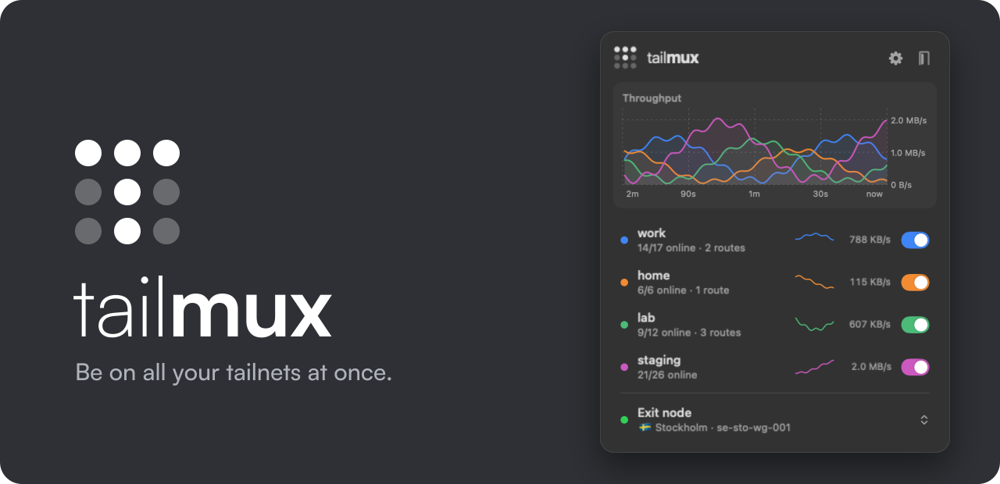

<p align="center">
  
</p>

<p align="center">
  <a href="https://github.com/GrowlyX/tailmux/actions/workflows/ci.yml"></a>
  <a href="https://github.com/GrowlyX/tailmux/releases/latest"></a>
</p>

Tailscale's client joins one tailnet at a time. tailmux joins them all and sends
each connection to the tailnet that owns it.

```sh
brew install growlyx/tap/tailmux
tailmux setup                        # add tailnets, log in
sudo brew services start tailmux     # every app can now reach every tailnet
```

`ssh db.home`, `curl http://grafana.work`, `psql -h db.corp.internal`: names
and subnets from every tailnet work side by side, even when two tailnets use the same IPs.

## Docs

- [Install](docs/install.md): macOS (Homebrew), Windows, Linux (`.deb`, `.rpm`, AppImage, Alpine, Arch, or from source), service modes
- [Setup and config](docs/setup.md): the `tailmux setup` TUI and every config key
- [Routing](docs/routing.md): how tailmux picks a tailnet, and what happens on conflicts
- [TUN mode](docs/tun.md): proxy-free, for every app
- [Proxy mode](docs/proxy.md): SOCKS5, HTTP, PAC, ssh, kubectl
- [Menu bar app](docs/menubar.md): macOS panel and window, local API
- [Desktop app](docs/desktop.md): the same for Windows and Linux
- [Updates](docs/updates.md): automatic, and how to turn that off
- [Development](docs/development.md): the in-process test lab, CI, releases
