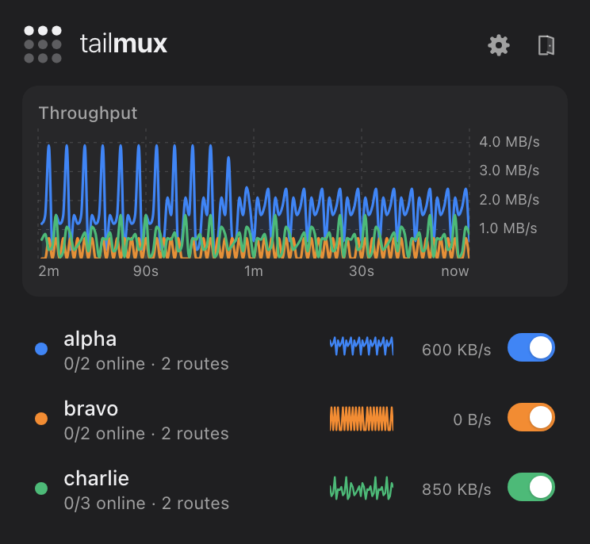

# Desktop app (Windows and Linux)

The tray app for Windows and Linux lives in [`desktop/`](../desktop/README.md).
It is a Tauri 2 app that mirrors the [macOS menu bar app](menubar.md):
the same dot-grid icon, panel, and main window with Overview, Tailnets,
Devices, Settings and Logs.

- Talks to the daemon's local HTTP API (see [menubar.md](menubar.md#api))
  from Rust, with the `X-Tailmux` header on every changing request.
- **Install service…** (Settings, or the offline view) runs the bundled
  `tailmux service install` with elevation: `pkexec` on Linux, a UAC prompt
  on Windows. TUN mode needs the service.
- **Start at login** registers the app with the OS (XDG autostart or the
  Windows registry).

Build, development and screenshot instructions are in the
[desktop README](../desktop/README.md).
