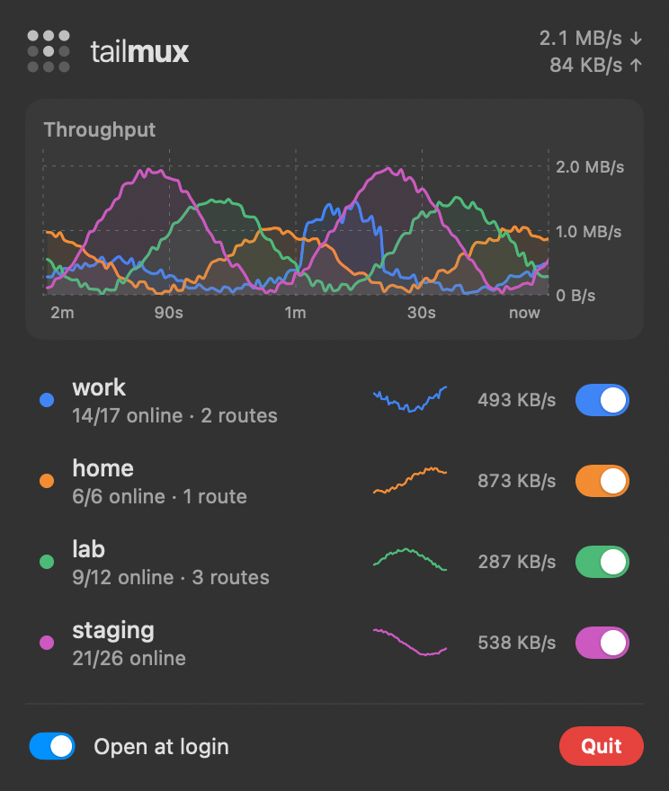

# Menu bar app



```sh
tailmux bar
```

The Homebrew install builds it. `tailmux setup` (or `tailmux bar`) copies it
into `/Applications`, so Spotlight and Launchpad find it. That has to happen
there: a formula's post-install step can't write outside Homebrew's prefix,
and Spotlight and Launchpad skip symlinks. The daemon refreshes that copy
whenever it starts on a new version, so it never goes stale. Then enable
**Open at login** in its settings. To keep it out of `/Applications`, delete
the copy and set `TAILMUX_NO_APPLICATIONS=1`.

- **Icon**: Tailscale's 3×3 dot grid, with one dot lit per connected tailnet.
  Dots fill in the order that draws Tailscale's "T", so five tailnets spell the
  logo. The grid dims when the daemon isn't running.
- **Switches**: turning a tailnet off works like `tailscale down` for that one
  tailnet. Its routes and names drop out immediately, it keeps its login, and
  tailmux remembers the choice.
- **Updates**: a banner offers a new release, with an **Update** button. The
  app relaunches itself after Homebrew upgrades it.
- **Exit node**: the row under the tailnets shows the chosen exit node and
  opens a menu like the official app's: **None**, your own exit nodes per
  tailnet, then Mullvad by country and city, each with **Best available**
  (the highest-priority node online, or the highest priority if none report
  presence). The choice applies right away. Everything no tailnet claims then
  leaves through it; the local network stays direct. In TUN mode that covers
  every app, in proxy mode only apps using the proxy. If the exit node can't
  be used, the row turns orange with the reason, and that traffic is blocked
  rather than sent direct. The main window's **Exit node** page lists every
  node with search by name, country or city.
- **Charts**: two minutes of per-tailnet throughput, plus a sparkline and the
  current rate on each row. Hover a row for its routes and byte totals.

To build it by hand, run `macos/build-app.sh`. It needs only the Command Line Tools.

## API

The app uses the daemon's local HTTP API (the `http` address, default `127.0.0.1:1056`):

| Endpoint | |
| --- | --- |
| `GET /status` | Tailnets, routes, conflicts, TUN state, the exit node (`exit_node`) |
| `GET /stats` | Per-tailnet byte counters and 120 one-second rate samples |
| `GET /resolve?host=` | Routing decision for one destination |
| `GET /proxy.pac` | The PAC file |
| `GET /peers` | Every device in every tailnet |
| `GET /exit-nodes` | `{"current", "nodes"}`: the exit node in use, and every device offering itself as one (own first, then by country, city and priority) |
| `PUT /exit-node` | Body `{"tailnet": "home", "node": "<fqdn or id>"}` picks one, `{}` turns it off; applies live. Requires `X-Tailmux` |
| `POST /update` | Install the latest release now; progress shows in `/status` |
| `POST /tailnets/{name}/enable`, `/disable` | Requires an `X-Tailmux` header, which blocks cross-site requests |
